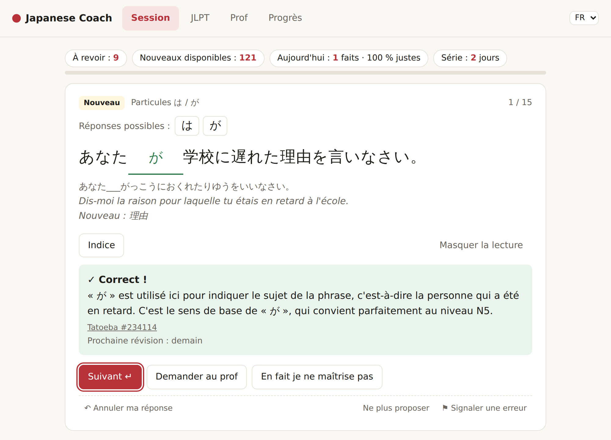
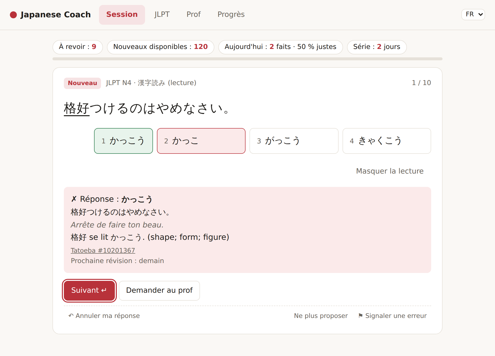
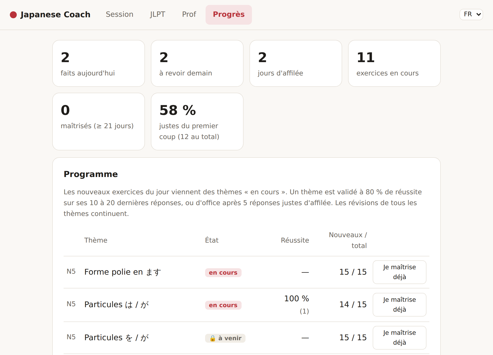

# Japanese Coach AI

*[English version](README.md)*

**Un prof de japonais personnel qui tourne sur ton propre ordinateur.** Des exercices quotidiens construits sur de *vraies* phrases, un programme JLPT N5 → N4, la répétition espacée de tes erreurs, des questions type JLPT et des examens blancs chronométrés, et un chat avec un prof animé par un LLM local. Interface en français ou en anglais.

<p align="center">
  
  
</p>

> Un projet d'apprentissage sur deux fronts : apprendre le japonais, et apprendre à faire travailler un LLM — y compris là où il ne faut *pas* lui faire confiance.

## Ce qui le rend différent

- **Les réponses ne sont jamais inventées.** Les exercices viennent de phrases [Tatoeba](https://tatoeba.org) découpées par un analyseur morphologique ([SudachiPy](https://github.com/WorksApplications/SudachiPy)) : la réponse est le texte d'origine, les lectures viennent de l'analyseur. Le LLM ([Qwen 3](https://ollama.com/library/qwen3) via [Ollama](https://ollama.com)) ne fait que filtrer et expliquer.
- **Les questions ambiguës sont écartées avant que tu les voies.** Une question où deux réponses sont justes est pire que pas de question. Des règles de grammaire les détectent (は/が seulement quand la grammaire tranche, paires de particules jamais proposées ensemble, morceaux de 並べ替え dont l'ordre est imposé…), le LLM donne un second avis, et des lots sont relus par Claude : les clés rejetées ne sont plus jamais générées, et la réserve se revérifie quand les règles s'améliorent. Les chiffres sont dans le [journal de tests](notes/log.md).
- **À ton niveau.** L'app lit ta collection [Anki](https://apps.ankiweb.net) (n'importe quel deck, Anki peut être fermé) et choisit des phrases dont tu connais les mots, plus un nouveau au maximum.
- **Fonctionne sans carte graphique.** Les exercices relus sont publiés dans une [banque partagée](https://github.com/Aymeric-Dcn/Japanese-AI-Coach-bank) que l'app télécharge au démarrage ; le modèle local ne sert qu'à en générer d'autres et au chat.
- **Rien ne sort de ton ordinateur** : réponses, progression et données Anki restent dans `data/`. Seule exception, si tu la choisis : le chat peut utiliser Claude ou ChatGPT avec ta propre clé d'API, et tes messages du chat partent alors chez ce fournisseur.

## Fonctionnalités

| | |
| --- | --- |
| **Session** | programme du jour (révisions + nouveaux exercices des deux thèmes en cours) ou entraînement libre par thème ; particules, conjugaisons, propositions relatives et subordonnées (前に, 後で, ても), remettre une phrase dans l'ordre d'après sa traduction ; annuler un mauvais clic (Ctrl+Z), « en fait je ne maîtrise pas », suspendre ou signaler un exercice |
| **JLPT** | 漢字読み, 表記, 文脈規定, 文法形式, 並べ替え ★ par niveau ; entraînement avec correction immédiate, ou examens blancs chronométrés notés par section |
| **Prof** | chat en trois modes — questions et corrections, conversation en japonais simple (7 situations), quiz sur tes points faibles — appuyé sur tes fiches de grammaire Anki, le programme et de vraies phrases ; modèle local, ou Claude / ChatGPT avec une clé d'API |
| **Progrès** | statistiques, programme avec progression automatique, révisions gérées à la main, remplissage de la réserve, banque partagée |

<p align="center"></p>

## Comment ça marche

```
Tatoeba ─► build_bank.py ─► data/bank.db          vraies phrases, découpées par SudachiPy
Anki ────► anki_sync.py ──► mots connus, lexique, fiches de grammaire, kanji
                │
                ▼
   make_exercises.py / jlpt_questions.py          trous et choix construits par des règles,
                │                                  ambiguïtés écartées, vérification LLM
                ▼
   data/coach.db ◄──► server.py + web/ → http://localhost:8000
   (réserve, réponses,      ▲
    révisions, chat)        │ review.py : revérifier · exporter → relire (Claude) → importer
                            │ bank_sync.py : publier ⇄ récupérer / contribuer
                            ▼
              Japanese-AI-Coach-bank (exercices relus, partagés)
```

## Démarrer

**Juste l'utiliser ?** Télécharge `JapaneseCoach.exe` sur la page [Releases](https://github.com/Aymeric-Dcn/Japanese-AI-Coach/releases) (Windows, sans installation) : double-clic, réponds à l'écran d'accueil, et les exercices relus sont téléchargés. Pour le construire toi-même : `pip install pyinstaller` puis `python tools/build_exe.py` → `dist/JapaneseCoach.exe`.

Configuration testée : Windows, RTX 4070 Super (12 Go), 32 Go de RAM.

1. **Installer** [Python 3.9+](https://www.python.org/downloads/) (cocher *Add python.exe to PATH*), puis `pip install -r requirements.txt`. Facultatif : [Ollama](https://ollama.com/download) et `ollama pull qwen3:14b` (≈ 9 Go, pour générer des exercices et pour le chat).
2. **Préparer les données** (une fois) :
   ```
   python tools/build_bank.py      # télécharger et analyser Tatoeba (≈ 1 min)
   python tools/jlpt_data.py       # listes JLPT libres
   python tools/anki_sync.py       # facultatif : ta collection Anki
   ```
3. **Lancer** `python server.py --open` → http://localhost:8000. Les exercices de la banque partagée arrivent au démarrage ; avec Ollama, « Progrès → Remplir la réserve » en génère d'autres. `python tools/install_autostart.py` lance l'app avec Windows.

Pour taper en japonais : Paramètres → Heure et langue → Langue et région → ajouter *Japonais*, basculer avec `Windows + Espace`.

**[Guide d'utilisation](docs/guide.fr.md)** : programme et thèmes, toutes les options, Anki, JLPT, contrôle qualité, banque partagée, démarrage en arrière-plan, mesure du LLM.

**[Sur ton téléphone, avec un Raspberry Pi](docs/raspberry-pi.fr.md)** : une seule progression pour le téléphone et le PC, via Tailscale (optionnel).

## Organisation du projet

```
server.py                l'app : serveur web + API JSON (bibliothèque standard seulement)
review.py, bank_sync.py, make_exercises.py   raccourcis des commandes les plus utilisées (coach/…)
web/                     l'interface (index.html, app.css, app.js, i18n.js : français / anglais)
coach/                   le cœur de l'app
  store.py, srs.py       base de progression : réserve, réponses, planning des révisions, chat
  curriculum.py          le programme : 23 thèmes N5 → N4, règles de progression, notes de grammaire
  review.py              contrôle qualité : revalidate, export, reject, import, approve
  bank_sync.py           banque partagée : pull, contribute, import-inbox, publish, send-texts
  tutor.py, knowledge.py, llm.py   le prof, ses références, Ollama / modèles en ligne
  lexicon.py, dictionary.py, words.py   listes de mots, fiches de mots (Jisho + kanji), mots d'une phrase
  build_bank.py          Tatoeba → SudachiPy → data/bank.db
  updater.py             mises à jour de l'app Windows depuis les releases GitHub
  exercises/             génération par règles : make_exercises.py, conjugate.py, clauses.py,
                         word_order.py, jlpt_questions.py, fill_reserve.py, sheet.py
  anki/                  anki_sync.py, anki_db.py : ta collection Anki
tools/                   commandes lancées à la main : build_bank, anki_sync, jlpt_questions, jlpt_data,
                         build_exe, install_autostart, evaluate, compare_models, generate_sheet…
tests/                   python -m unittest discover tests (+ eval/ : cas pour evaluate.py)
resources/               kanji_info.json (KANJIDIC)
deploy/                  service Raspberry Pi (install-pi.sh)
notes/log.md             journal des tests : modèles, prompts, ce qui a raté et comment c'est corrigé
```

## Feuille de route

- [x] Exercices sur de vraies phrases, synchronisation Anki (i+1), particules et conjugaisons
- [x] App locale : programme N5 → N4, répétition espacée, entraînement libre, annulation et révisions à la main
- [x] Questions JLPT (5 types), entraînement et examens blancs chronométrés
- [x] Chat avec le prof et références, modes conversation et quiz
- [x] Règles d'ambiguïté, contrôle qualité et boucle de relecture avec Claude
- [x] Interface français / anglais
- [x] Banque partagée d'exercices relus
- [ ] Mode sans Anki (test de niveau), données par défaut tirées du [Full Japanese Study Deck](https://github.com/Ronokof/Full-Japanese-Study-Deck)
- [x] App Windows (`.exe`) : assistant d'accueil (niveau, Anki, prof, mises à jour), se met à jour toute seule depuis les releases GitHub
- [x] Modèles en ligne facultatifs pour le chat (clé API Claude / OpenAI)
- [x] Téléphone : app web installable (PWA), servie par un Raspberry Pi via Tailscale
- [ ] Compréhension écrite (読解) et orale

## Sources de données et droits

Le code est sous [licence MIT](LICENSE). Ce dépôt ne contient que du code, des prompts et de la documentation. Les données personnelles et téléchargées (`data/` : bases, exports Anki, réglages) sont exclues par le `.gitignore`.

Sources : [Tatoeba](https://tatoeba.org) (CC BY 2.0 FR), [open-anki-jlpt-decks](https://github.com/jamsinclair/open-anki-jlpt-decks) (MIT) tiré des listes JLPT de Jonathan Waller sur [tanos.co.uk](http://www.tanos.co.uk/jlpt/) (CC BY), [SudachiPy](https://github.com/WorksApplications/SudachiPy) et son dictionnaire (Apache 2.0), [Qwen 3](https://ollama.com/library/qwen3) (Apache 2.0), fiches de mots : [Jisho](https://jisho.org) (recherche en ligne, [JMdict](https://www.edrdg.org/wiki/index.php/JMdict-EDICT_Dictionary_Project), CC BY-SA 4.0) et KANJIDIC2 ([EDRDG](https://www.edrdg.org/edrdg/licence.html), CC BY-SA 4.0) via [kanji-data](https://github.com/davidluzgouveia/kanji-data) (MIT), dans `resources/kanji_info.json`. La banque d'exercices partagée a sa propre licence (CC BY-SA 4.0), voir [son dépôt](https://github.com/Aymeric-Dcn/Japanese-AI-Coach-bank).
