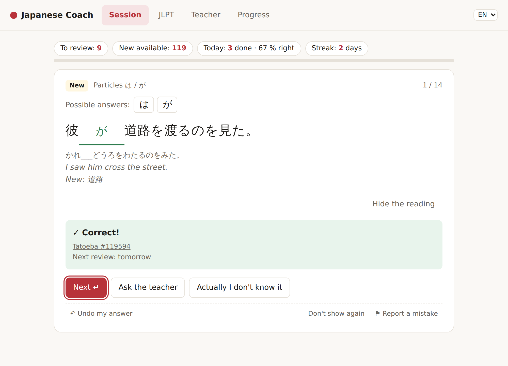
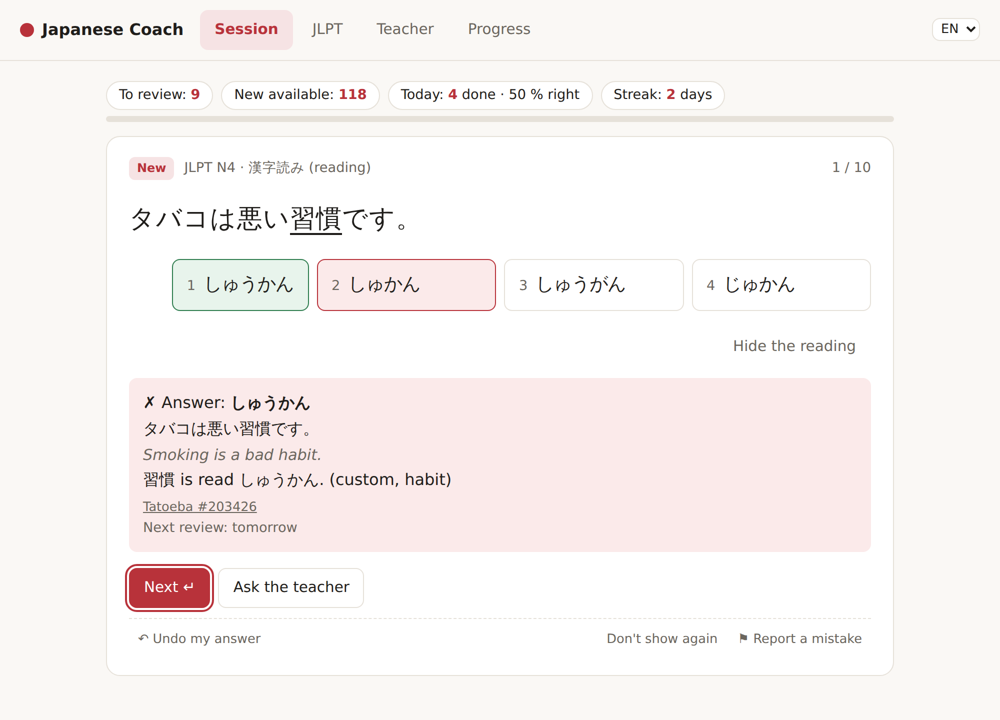
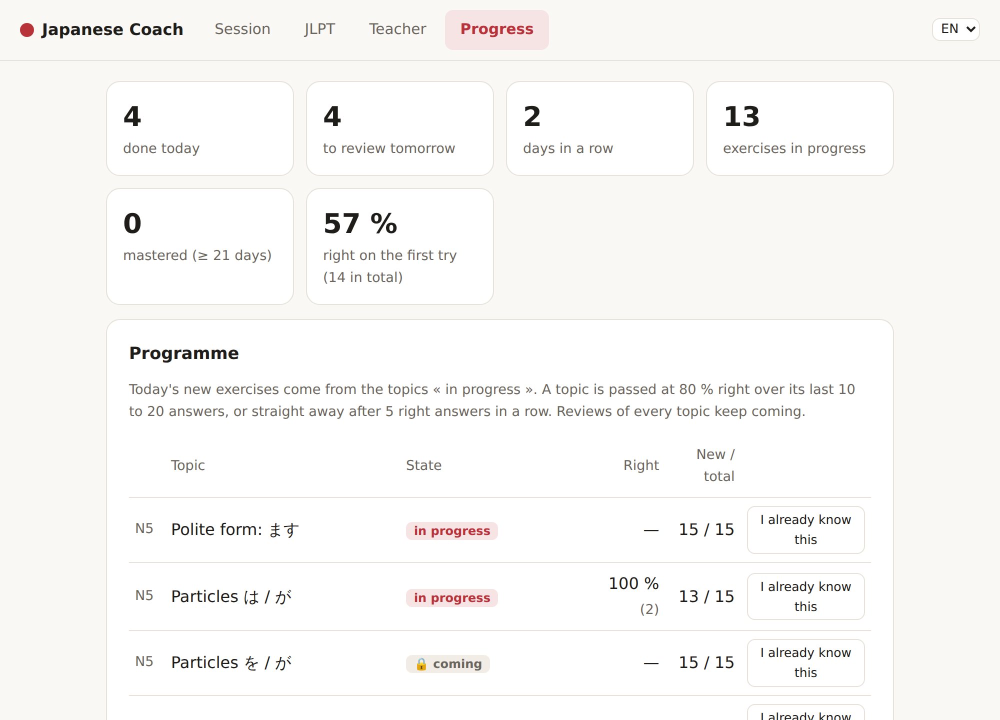

# Japanese Coach AI

*[Version française](README.fr.md)*

**A personal Japanese tutor that runs on your own computer.** Daily exercises built from *real* sentences, a JLPT N5 → N4 program, spaced repetition of your mistakes, JLPT-style questions and timed mock exams, and a chat with a tutor powered by a local LLM. Interface in French or English.

<p align="center">
  
  
</p>

> A learning project on two fronts: learning Japanese, and learning how to put an LLM to work — including where *not* to trust it.

## What makes it different

- **The answers are never invented.** Exercises come from [Tatoeba](https://tatoeba.org) sentences cut with a morphological analyzer ([SudachiPy](https://github.com/WorksApplications/SudachiPy)): the answer is the original text, readings come from the analyzer. The LLM ([Qwen 3](https://ollama.com/library/qwen3) through [Ollama](https://ollama.com)) only filters and explains.
- **Ambiguous questions are caught before you see them.** A question where two answers are right is worse than no question. Grammar rules detect them (は/が only where the grammar decides, particle pairs never offered together, 並べ替え pieces whose order is fixed…), the LLM gives a second opinion, and batches are reviewed by Claude: rejected keys are never generated again, and the reserve re-checks itself when the rules improve. See the [test log](notes/log.md) for the numbers.
- **At your level.** It reads your [Anki](https://apps.ankiweb.net) collection (any deck, Anki can be closed) and picks sentences whose words you know, plus at most one new one.
- **Works without a GPU.** Reviewed exercises are published in a [shared bank](https://github.com/Aymeric-Dcn/Japanese-AI-Coach-bank) that the app downloads at startup; the local model is only needed to generate more and for the chat.
- **Nothing leaves your computer**: answers, progress and Anki data stay in `data/`. The only exception is opt-in: the chat can use Claude or ChatGPT with your own API key, and then your chat messages go to that provider.

## Features

| | |
| --- | --- |
| **Session** | today's program (reviews + new exercises of the two current topics) or free practice by topic; particles, conjugations, relative clauses and subordinates (前に, 後で, ても), putting a sentence back in order from its translation; undo a misclick (Ctrl+Z), « actually I don't know it », suspend or report an exercise |
| **JLPT** | 漢字読み, 表記, 文脈規定, 文法形式, 並べ替え ★ by level; practice with instant correction, or timed mock exams scored by section |
| **Teacher** | chat in three modes — questions and corrections, conversation in simple Japanese (7 situations), quiz on your weak points — grounded in your Anki grammar notes, the program and real sentences; local model, or Claude / ChatGPT with an API key |
| **Progress** | stats, program with automatic progression, reviews managed by hand, reserve top-up, shared bank |

<p align="center"></p>

## How it works

```
Tatoeba ─► build_bank.py ─► data/bank.db          real sentences, split by SudachiPy
Anki ────► anki_sync.py ──► known words, lexicon, grammar notes, kanji
                │
                ▼
   make_exercises.py / jlpt_questions.py          blanks and choices built by rules,
                │                                  ambiguous ones dropped, LLM check
                ▼
   data/coach.db ◄──► server.py + web/ → http://localhost:8000
   (reserve, answers,       ▲
    reviews, chat)          │ review.py: revalidate · export → review (Claude) → import
                            │ bank_sync.py: publish ⇄ pull / contribute
                            ▼
              Japanese-AI-Coach-bank (shared, reviewed exercises)
```

## Getting started

**Just want to use it?** Download `JapaneseCoach.exe` from the [Releases](https://github.com/Aymeric-Dcn/Japanese-AI-Coach/releases) page (Windows, no install): double-click, answer the welcome screen, and the reviewed exercises are downloaded. To build it yourself: `pip install pyinstaller` then `python build_exe.py` → `dist/JapaneseCoach.exe`.

Tested on Windows with an RTX 4070 Super (12 GB) and 32 GB of RAM.

1. **Install** [Python 3.9+](https://www.python.org/downloads/) (tick *Add python.exe to PATH*), then `pip install -r requirements.txt`. Optional: [Ollama](https://ollama.com/download) and `ollama pull qwen3:14b` (≈ 9 GB, for generating exercises and the chat).
2. **Prepare the data** (once):
   ```
   python build_bank.py      # download and analyze Tatoeba (≈ 1 min)
   python jlpt_data.py       # open JLPT word lists
   python anki_sync.py       # optional: your Anki collection
   ```
3. **Start** `python server.py --open` → http://localhost:8000. Exercises of the shared bank arrive at startup; with Ollama, « Progress → Fill the reserve » generates more. `python install_autostart.py` starts the app with Windows.

To type Japanese: Windows Settings → Time & language → Language & region → add *Japanese*, switch with `Windows + Space`.

**[User guide](docs/guide.md)**: program and topics, every option, Anki, JLPT, quality control, shared bank, background start, measuring the LLM.

**[On your phone, with a Raspberry Pi](docs/raspberry-pi.md)**: one progress for the phone and the PC, through Tailscale (optional).

## Project layout

```
server.py           the app: web server + JSON API (standard library only)
web/                interface (index.html, app.css, app.js, i18n.js: French / English)
store.py            progress database: reserve, answers, review schedule, chat
curriculum.py       the program: 23 topics N5 → N4, progression rules, grammar notes
make_exercises.py   particle / conjugation exercises from the bank, ambiguity rules
jlpt_questions.py   JLPT questions: distractors, ambiguity rules; conjugate.py: verb conjugator
word_order.py, clauses.py   sentence-order exercises; relative clauses, 前に / 後で, ても (rules only)
updater.py          updates of the Windows app from GitHub releases
review.py           quality control: revalidate, export, reject, import, approve
bank_sync.py        shared bank: pull, contribute, import inbox, publish
tutor.py, knowledge.py   the chat tutor and its references
llm.py              Ollama client (structured answers, streaming)
build_bank.py       Tatoeba → SudachiPy → data/bank.db
anki_sync.py, anki_db.py, lexicon.py, jlpt_data.py   Anki and word lists
fill_reserve.py, srs.py, install_autostart.py, evaluate.py (+ eval/), compare_models.py
notes/log.md        test log: models, prompts, what went wrong and how it was fixed
```

## Roadmap

- [x] Exercises from real sentences, Anki sync (i+1), particles and conjugations
- [x] Local app: program N5 → N4, spaced repetition, free practice, undo and manual reviews
- [x] JLPT questions (5 types), practice and timed mock exams
- [x] Tutor chat with references, conversation and quiz modes
- [x] Ambiguity rules, quality control and review loop with Claude
- [x] French / English interface
- [x] Shared bank of reviewed exercises
- [ ] Mode without Anki (level test), default data from the [Full Japanese Study Deck](https://github.com/Ronokof/Full-Japanese-Study-Deck)
- [x] Windows app (`.exe`): welcome wizard (level, Anki, teacher, updates), updates itself from GitHub releases
- [x] Optional cloud models for the chat (Claude / OpenAI API key)
- [x] Phone: installable web app (PWA), served by a Raspberry Pi through Tailscale
- [ ] Reading comprehension (読解) and listening

## Data sources and licences

The code is under the [MIT licence](LICENSE). This repository contains code, prompts and documentation only. Personal and downloaded data (`data/`: databases, Anki exports, settings) is excluded by `.gitignore`.

Sources: [Tatoeba](https://tatoeba.org) (CC BY 2.0 FR), [open-anki-jlpt-decks](https://github.com/jamsinclair/open-anki-jlpt-decks) (MIT) from Jonathan Waller's JLPT lists on [tanos.co.uk](http://www.tanos.co.uk/jlpt/) (CC BY), [SudachiPy](https://github.com/WorksApplications/SudachiPy) and its dictionary (Apache 2.0), [Qwen 3](https://ollama.com/library/qwen3) (Apache 2.0), word cards: [Jisho](https://jisho.org) (searched online, [JMdict](https://www.edrdg.org/wiki/index.php/JMdict-EDICT_Dictionary_Project), CC BY-SA 4.0) and KANJIDIC2 ([EDRDG](https://www.edrdg.org/edrdg/licence.html), CC BY-SA 4.0) through [kanji-data](https://github.com/davidluzgouveia/kanji-data) (MIT), in `resources/kanji_info.json`. The shared exercise bank has its own licence (CC BY-SA 4.0), see [its repository](https://github.com/Aymeric-Dcn/Japanese-AI-Coach-bank).
